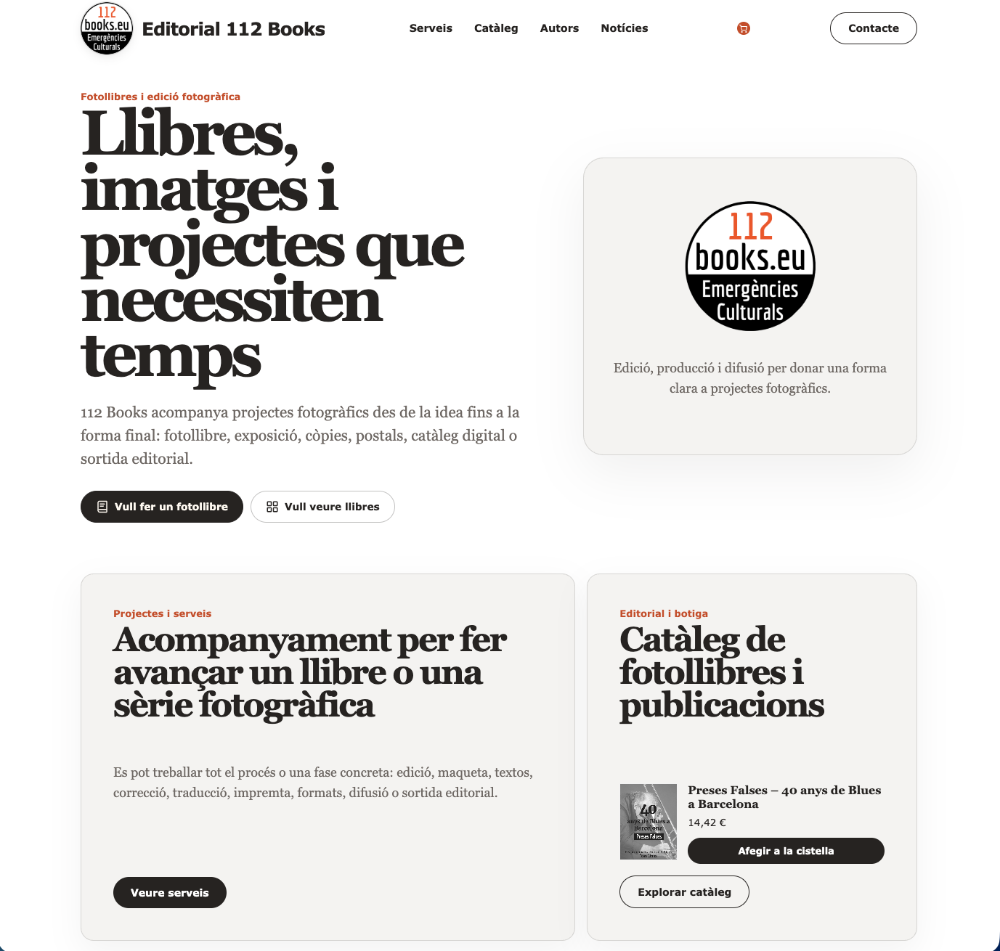
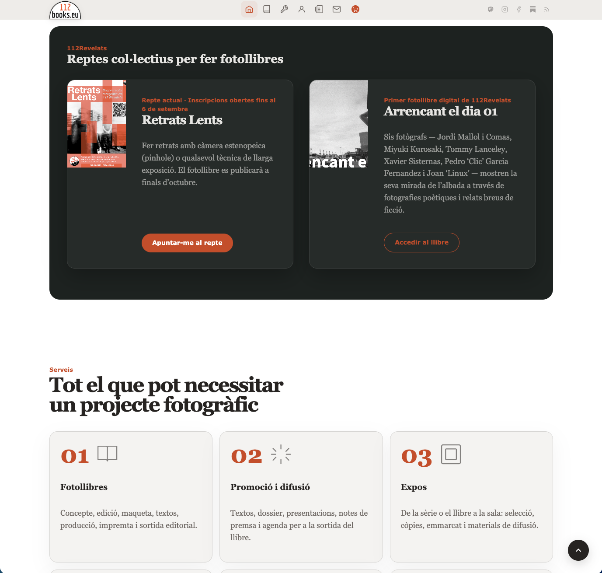
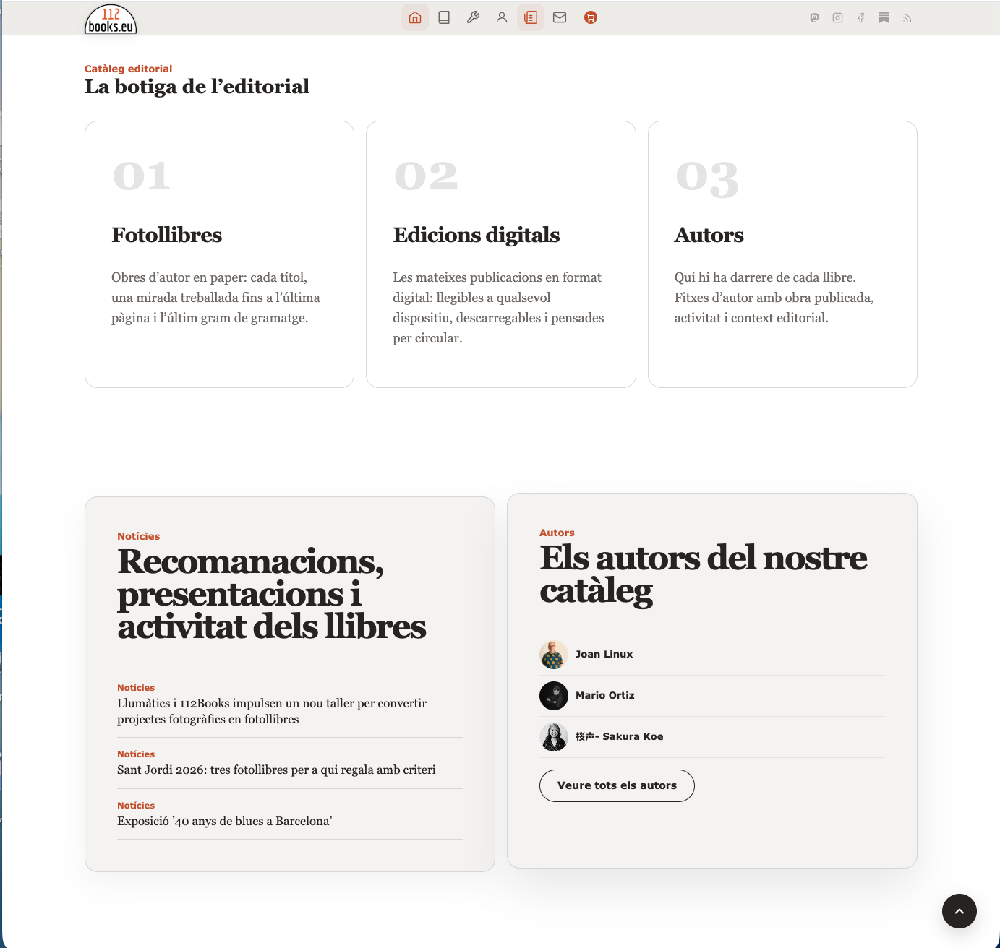
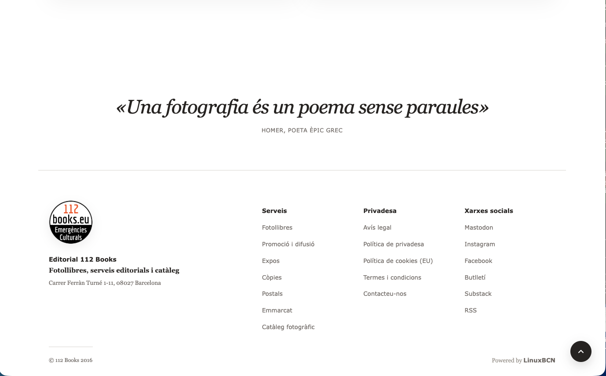
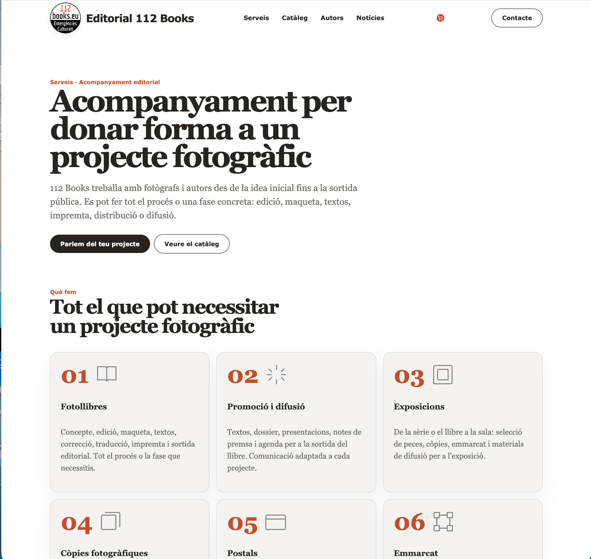
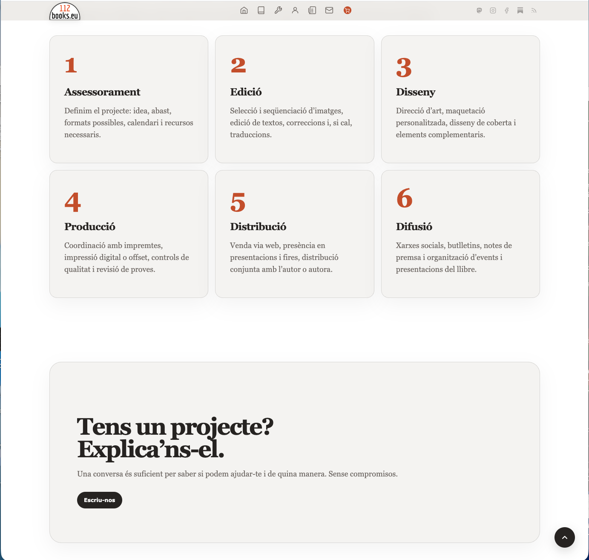
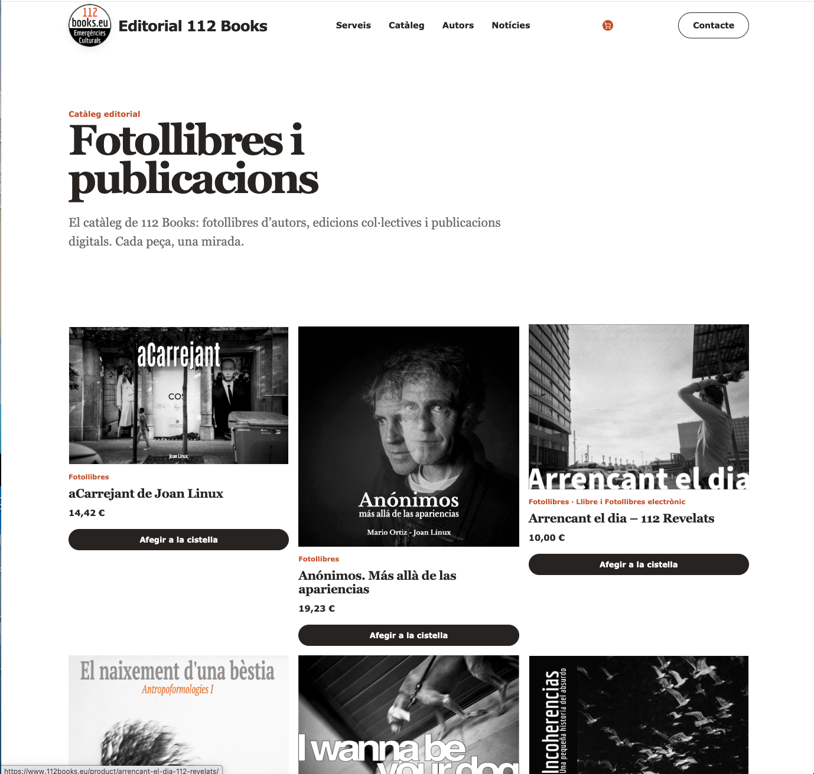
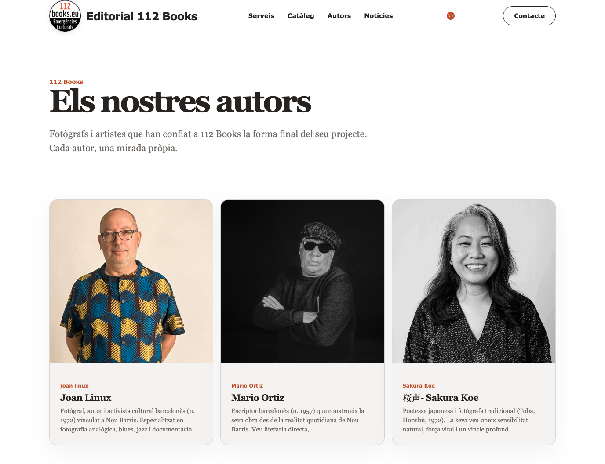
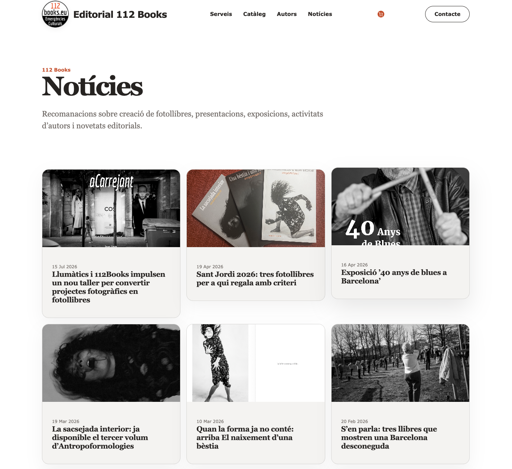

## El problema no era visual. Era estructural.

112Books és una editorial independent de Barcelona especialitzada en fotollibres i projectes fotogràfics. Acompanyen fotògrafs i autors des de la idea inicial fins a la publicació: maquetació, impressió, edició, distribució, difusió.

Durant anys, el web havia crescut sense un pla clar. S'hi anaven afegint continguts, seccions i plugins. El resultat era un site que *funcionava* però que no explicava bé qui és 112Books ni el que fan.

Un visitant nou no tenia clar si estava davant d'una impremta, una galeria, una llibreria o una editorial. La informació existia —però estava barrejada, enterrada, sense jerarquia.

El repte no era fer un web «més bonic». Era reorganitzar tota la informació per fer-la útil de veritat.

---

## Tres pilars, tres seccions clares

La decisió editorial més important del projecte va ser definir amb precisió els tres àmbits d'activitat de 112Books, i construir el web al voltant d'ells.

**1. El servei d'acompanyament**

El nucli del negoci: guiar autors al llarg de tot el procés de producció d'un fotollibre. De la idea a l'obra acabada. Maquetació, selecció i seqüenciació d'imatges, impressió, tiratge, distribució.

Ara ocupa el lloc que li correspon: la primera cosa que explica el web.

**2. El catàleg de venda**

Alguns dels autors que han passat pel procés d'acompanyament han volgut posar els seus llibres a la venda a través de 112Books. No tots — és una decisió de cada autor.

El catàleg recull aquestes obres: fotollibres disponibles per comprar, amb fitxa completa i integració directa amb WooCommerce.

**3. El directori d'autors**

Un espai de transparència. 112Books ha treballat amb molts fotògrafs i autors al llarg dels anys. Aquells que ho han volgut apareixen al directori: qui són, en quins projectes han participat, quins llibres han publicat.

D'altres prefereixen que la seva relació amb l'editorial quedi privada. Totalment respectable — la creació d'una obra és un procés íntim, i no tothom vol que es sàpiga qui l'ha acompanyat. El directori reflecteix exactament aquesta realitat: hi apareix qui vol aparèixer.

---

## Un Frankenstein que calia substituir

El web anterior havia crescut per acumulació. Un tema base modificat amb capes de CSS afegit al llarg dels anys. Plugins per suplir el que el tema no feia. Seccions sense coherència entre elles.

No reflectia la identitat de l'editorial. No tenia ritme visual. Un visitant nou no sabia on era ni el que hi podia trobar.

Vam decidir no retocar-lo. Vam decidir construir un tema nou des del primer commit.

---

## Construït des de zero amb FSE

Des de la versió 5.9, WordPress permet construir temes íntegrament amb blocs — el sistema **Full Site Editing (FSE)**. Plantilles HTML, `theme.json` per als design tokens (tipografia, colors, espaiats), CSS net. Sense capes, sense herència de PHP que ningú recorda d'on ve.

Ho vam aprofitar per establir una base sòlida des del principi:

- **Paleta editorial reduïda**: blanc, una superfície càlida lleugerament trencada (#F4F4F1), text quasi negre (#211D1B), i el vermell corporatiu (#D51F17) com a únic accent.
- **Tipografia**: Georgia per als cossos i textos editorials, Verdana per als elements d'interfície.
- **WooCommerce integrat des del disseny**, no afegit a posteriori. El catàleg, les fitxes de producte i la cistella comparteixen la mateixa identitat visual que la resta del web.
- **Sense plugins innecessaris**: el formulari de contacte és un shortcode propi, el lightbox és JavaScript nadiu, la paginació en català és un filtre WordPress.

---

## GitHub i Claude com a eines de treball

Tot el codi viu a **GitHub** des del primer commit, amb un script de sincronització automàtica que confirma cada sessió al repositori. 83 commits en 5 dies de treball intensiu.

Hem fet servir **Claude** (Anthropic) com a copilot: implementació de patrons CSS complexos, revisió d'accessibilitat, generació de templates FSE, depuració de conflictes entre WooCommerce i el tema.

No és un tema generat per IA. És un tema construït per humans amb IA com a eina. La diferència importa.

---

## El resultat

La portada explica en cinc segons el que fa 112Books. El titular ocupa l'espai que li correspon. Dos accessos directes: el servei d'acompanyament i el catàleg editorial.

Més avall, els projectes col·lectius actuals i el desglossament dels set àmbits de servei: fotollibres, promoció i difusió, exposicions, còpies, postals, emmarcat, catàleg fotogràfic.

La botiga de l'editorial, les recomanacions editorials i el directori d'autors, tots integrats en el flux de la pàgina principal.

El footer recull la identitat de la marca, l'adreça física, la navegació per serveis i les xarxes socials. I la cita d'Homer que 112Books fa seva: *«Una fotografia és un poema sense paraules»*.

---

La pàgina de serveis deixa clar el nucli del negoci: acompanyament integral per a la producció d'un fotollibre, de la idea a la difusió.

El procés s'articula en sis fases: assessorament, edició, disseny, producció, distribució i difusió. I al final, una crida directa: *«Tens un projecte? Explica'ns-el.»*

---

El catàleg presenta els fotollibres disponibles amb portada, autor i preu. Integrat directament amb WooCommerce — compra en un clic, sense sortir del web.

---

El directori d'autors és un espai de transparència. Cada autor que ha volgut aparèixer-hi té la seva fitxa: qui és, en quins projectes ha participat, quins llibres ha publicat.

D'altres prefereixen que la seva relació amb l'editorial quedi privada. El directori ho respecta: hi apareix qui vol aparèixer.

---

La secció de notícies recull recomanacions, presentacions, exposicions i novetats del catàleg. Contingut propi, sense algorismes ni plataformes de tercers.

---

## Analítica sense cookies

El web fa servir **GoatCounter** per a l'analítica. Sense cookies, sense seguiment de tercers, sense consentiment forçat. Les dades queden a la infraestructura pròpia i no surten mai a cap plataforma publicitària.

Com a complement, hem construït un **plugin propi per a WordPress** que mostra les estadístiques directament des del tauler d'administració: visites per període, pàgines més vistes, navegadors, sistemes operatius i distribució per país.

---

## Tecnologia

WordPress FSE · theme.json · WooCommerce · GitHub · Claude · GoatCounter · PHP · JavaScript · CSS Grid

---

→ [112books.eu](https://112books.eu)
→ [Plugin GoatCounter per a WordPress — projecte relacionat](/ca/projectes/goatcounter-wp/)
