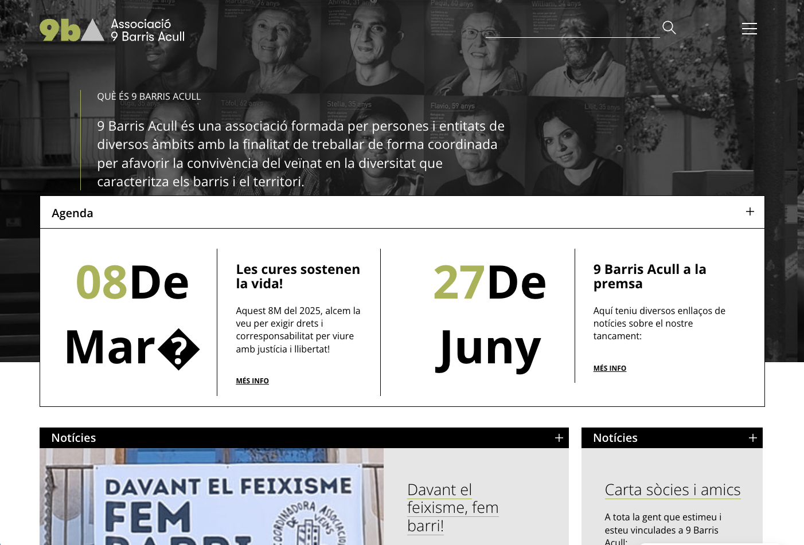

## A necessary organisation

For years, 9 Barris Acull was one of the reference organisations for the reception and support of newcomers in the Nou Barris district of Barcelona. Hundreds of cases annually, thousands of accumulated users, and a solid track record of rigorous, necessary social work.

The withdrawal of public funding forced its closure.

We keep the website open as a testimony to work well done.

---

## What we did

The WordPress design was not our work, but many of the communication strategies were — and above all, the most important tool in the project: a web application developed with **Drupal** that centralised all of the organisation's internal management.

**User case management with full GDPR compliance**

The application allowed the secure, structured management of files for thousands of users: consultations, situations, ongoing procedures, histories. All in strict compliance with data protection laws, with role-based access controls and operation logging.

**A reference social database**

Over the years, the application accumulated an exhaustive record of the consultations and situations of the people served. Each year, the system could extract relevant statistics on the phenomenon of immigration in the district: types of consultations, countries of origin, legal situations, most frequent needs.

Data that could have informed public policy. Data that will no longer exist.

---

## Reflection

It is a shame that such a necessary project was not valued as it deserved.

A technically solid tool, a committed human team, social work that no one else was doing in the same way. All of it left to die by political decisions that failed to recognise the real value of what they had before them.

The website remains. The work done, too.

---

## Screenshot

---

## Technology

Drupal · WordPress · Case management · GDPR · Social statistics

---

→ [9bacull.org](https://9bacull.org)
