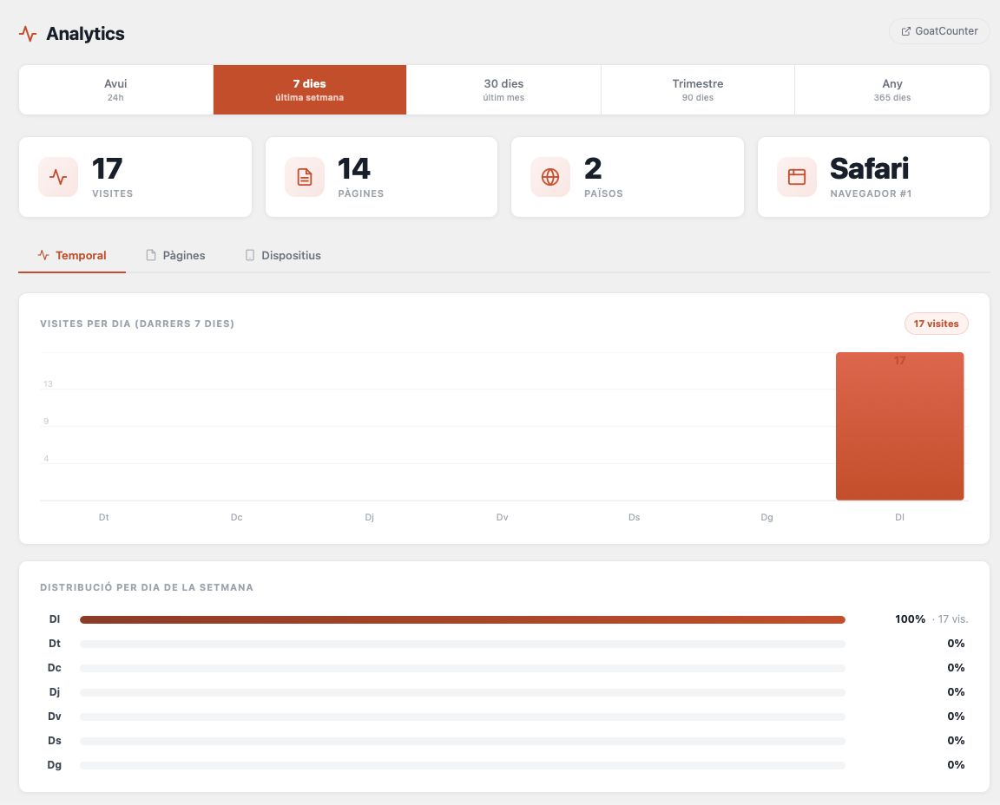
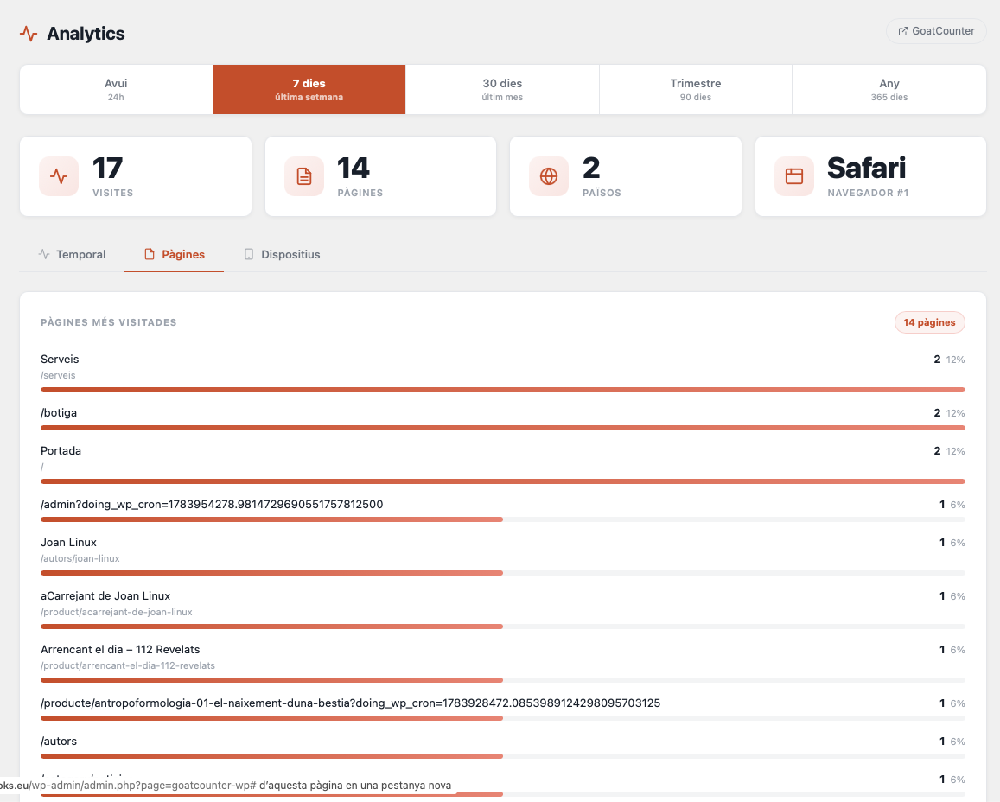
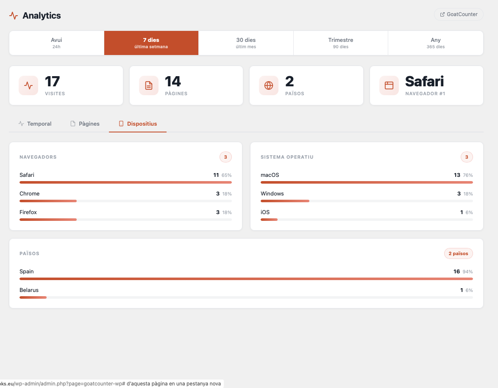
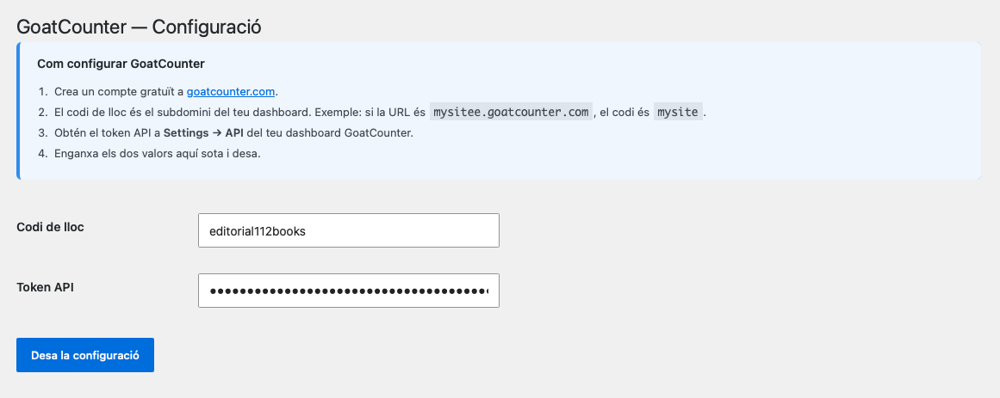

## El problema amb Google Analytics

La majoria de webs fan servir Google Analytics. És gratis, és potent, i fa anys que és el estàndard. Però té un cost ocult: requereix un banner de consentiment de cookies, transmet dades a servidors de Google, i posa el teu trànsit en mans d'una plataforma publicitària.

Per a molts projectes — blogs, webs d'artistes, editorials independents, petites empreses — Google Analytics és un excés. El que necessiten és saber quantes visites reben, quines pàgines funcionen millor, i d'on venen els visitants. Res més.

**GoatCounter** resol exactament això. Sense cookies. Sense dades personals. Sense cap necessitat de banner de consentiment GDPR.

---

## Un plugin, no una integració manual

GoatCounter ja ofereix una manera senzilla d'integrar-se: un sol script JavaScript a l'`<head>` o al `<footer>`. Però per a WordPress, volíem alguna cosa millor:

- Que l'script s'injectés automàticament sense tocar codi
- Que les estadístiques fossin visibles **directament al tauler d'administració**, sense haver d'obrir una altra pestanya
- Que estigués disponible en **català**

Vam construir el plugin des de zero.

---

## Tres pestanyes, cinc períodes

El panell d'estadístiques s'organitza en tres vistes:

**Temporal** — La vista principal. Mostra les visites en el temps amb un gràfic de barres SVG, resum de mètriques (visites totals, pàgines vistes, països, navegador principal) i la distribució per dia de la setmana amb percentatge i nombre de visites.

**Pàgines** — Les pàgines més visitades amb el títol de la pàgina WordPress (no la URL), percentatge i accés directe a la pàgina.

**Dispositius** — Navegadors, sistemes operatius i països, tots amb barres de percentatge visuals.

El selector de període és una barra de navegació de cinc opcions: avui, 7 dies, 30 dies, trimestre (90 dies) i any (365 dies). La pestanya activa es recorda entre recàrregues de pàgina gràcies a localStorage.

---

## El gràfic

El gràfic de barres és SVG generat directament en PHP. Adapta la granularitat automàticament al període:

- **Avui**: barres per hora
- **7 dies**: barres per dia
- **30 dies** i **trimestre**: barres per setmana
- **Any**: barres per mes

Degradat vermell corporatiu, línies de guia horitzontals amb valors, i etiquetes de dates adaptades en català (Dl, Dt, Dc, Dj, Dv, Ds, Dg per als períodes setmanals).

---

## Sense cookies. Sense banner.

GoatCounter no fa servir cookies. No recull adreces IP ni cap altra dada personal. Per tant, **no cal cap banner de consentiment GDPR**.

Les dades queden als servidors de GoatCounter (o als teus propis si el fas servir en mode self-hosted). Cap dada va a Google, Meta ni cap plataforma publicitària.

---

## Configuració en tres passos

1. Crea un compte gratuït a [goatcounter.com](https://www.goatcounter.com). Confirma el correu electrònic (revisa el SPAM — el correu de confirmació hi pot acabar). **Fins que no confirmes el correu, la secció de tokens API no apareix.**
2. A **Analytics → Configuració** del teu WordPress, introdueix el codi de lloc (el subdomini del teu dashboard de GoatCounter) i el token API.
3. Fet. L'script de seguiment s'injecta automàticament al footer.

---

## Codi obert · Aprovat per WordPress.org

El plugin és **GPL-2.0**, aprovat i publicat per [linuxbcn](https://profiles.wordpress.org/linuxbcn/) al directori oficial de WordPress.org:

→ [wordpress.org/plugins/linuxbcn-analytics-for-goatcounter](https://wordpress.org/plugins/linuxbcn-analytics-for-goatcounter/)

Pots instal·lar-lo directament des del teu WordPress: **Plugins → Afegir nou** → cerca "LinuxBCN Analytics".

El codi font és també accessible a GitHub:

→ [github.com/112books/goatcounter-wp](https://github.com/112books/goatcounter-wp)

---

## Tecnologia

PHP · WordPress Plugin API · GoatCounter API v0 · SVG · CSS Grid · JavaScript · localStorage · GitHub Actions

---

→ [wordpress.org/plugins/linuxbcn-analytics-for-goatcounter](https://wordpress.org/plugins/linuxbcn-analytics-for-goatcounter/)
→ [github.com/112books/goatcounter-wp](https://github.com/112books/goatcounter-wp)
→ [Web de 112books.eu — projecte relacionat](/ca/projectes/112books-theme/)
