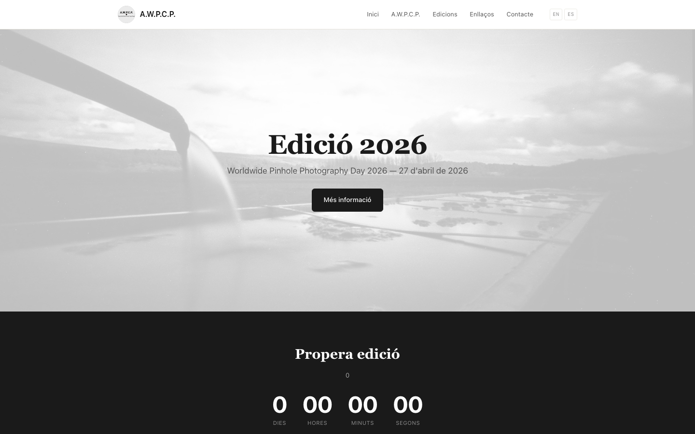

## 14 editions of Worldwide Pinhole Photography Day in Barcelona

A.W.P.C.P. organises the Worldwide Pinhole Photography Day
in Barcelona since 2011. Every last Sunday of April, photographers
around the world shoot a pinhole camera at the same moment.
Barcelona has participated since the first edition.

The website had been running on a WordPress server with fourteen
years of accumulated content. In 2024 we migrated it to Hugo +
GitHub Pages: no server, no database, all content versioned in Git.

---

## Tech stack

**Hugo 0.159** — 229 pages generated in under 5 seconds.  
**GitHub Pages** — global CDN, automatic deploy.  
**GitHub Actions** — build and deploy in ~30 seconds per push.  
**GoatCounter** — lightweight analytics (3 KB), cookieless, with [custom dashboard](/en/projectes/goatcounter-dashboard/).

3 languages · Catalan default (no prefix) · English `/en/` · Spanish `/es/`

---

## The migration

14 editions. 105 pinhole camera photographs from participants.
Original posters from 2011 to 2025. All content exported from the
original WordPress, rewritten in Markdown with Hugo frontmatter.

Images were recovered directly from the old WP server via `curl`.
Legacy URLs maintain compatibility through 301 redirects.

---

## Architecture

```
content/
  editions/
    2011/ … 2026/        # One folder per edition
      cameras/           # Cameras subsection
        bonita/          # Each camera: multilingual leaf bundle
      _index.{ca,en,es}.md
  about/  contact/  links/
```

Custom permalinks for editions (`/:slug/`).
Automatic fallback to camera images when no poster is available.

---

## Features

**Countdown** to the next edition — calculated in minimal JS,
no external dependencies.

**Mobile menu** — bottom tab bar with SVG icons,
visible only at ≤640px. Language selector always visible in header.

**Technical SEO** — JSON-LD Organization schema, Open Graph,
Twitter Cards, `sitemap.xml`, `robots.txt`, `noindex` on 404.

---



---

→ [awpcp.org](https://awpcp.org)
