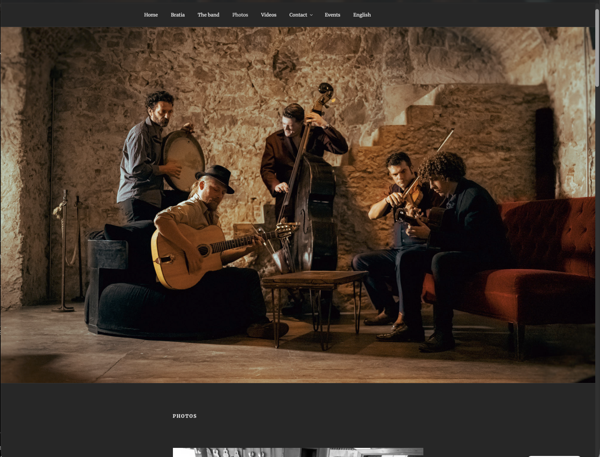
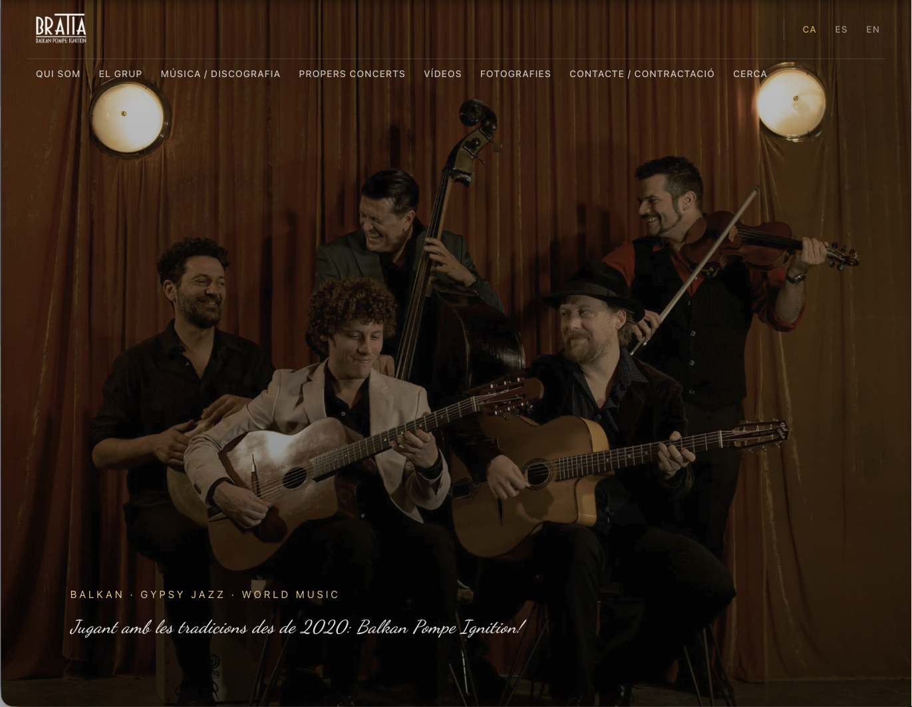
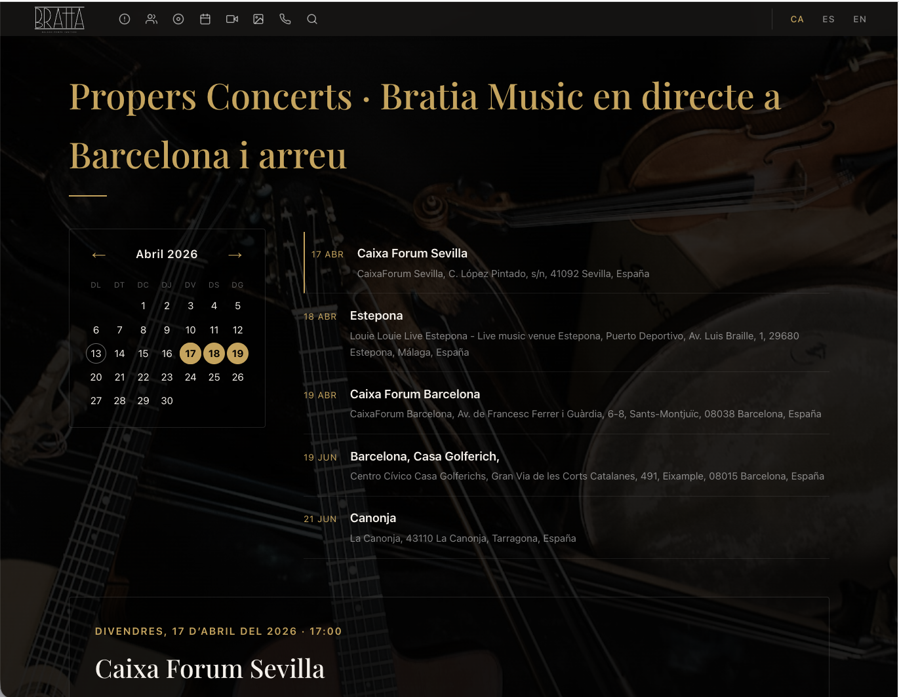
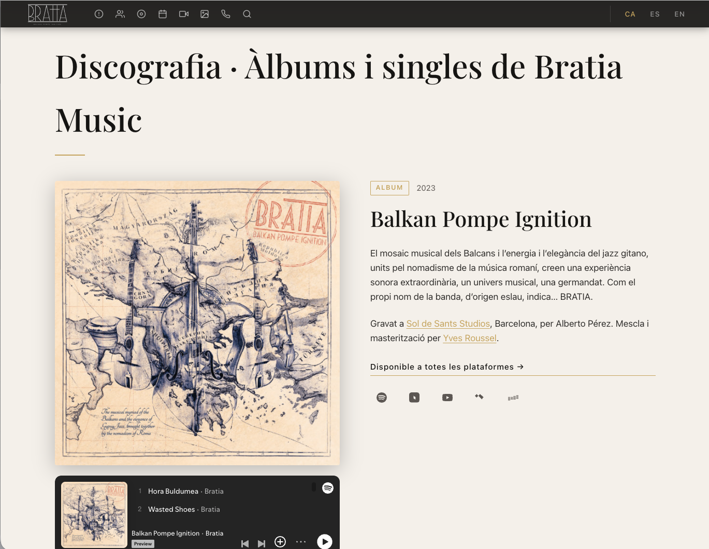
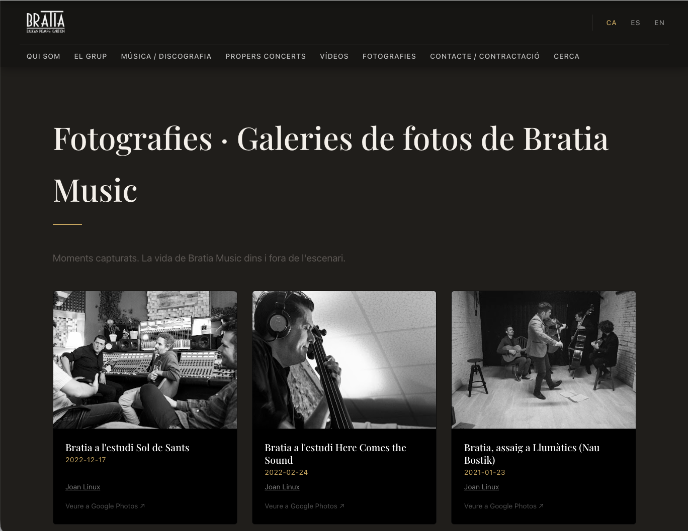

## Balkan Gypsy Jazz from Barcelona

Bratia is a Barcelona band formed by musicians
with international careers — Ivan Kovačević, Pere Nolasc
Plana, Victor Paradis, Julien Chanal and Stelios Togias —
specialising in the fusion of manouche jazz, Balkan music
and gypsy jazz.

The previous website was a heavy, hard-to-maintain WordPress
that required technical intervention for any change.
The real problem: touring musicians don't have time
to manage websites.

---

## The problem

An active band needs the website to update itself.

New concerts, new videos, new photos, new records.
If every update requires accessing a complex manager
or depending on a technician, the website becomes
obsolete within weeks.

---

## The solution

A system that works with the tools the band
already uses, without adding new work.

**Automatic concert agenda**
Concerts are entered into Google Calendar
and appear automatically on the website. No backend,
no duplicating work.

**Videos synchronised with YouTube**
The videos section updates itself when the band
uploads content to their channel. No uploading files,
no managing anything extra.

**Photographs from Google Photos**
Photographers upload images directly to Google Photos
and they appear in the website albums. The system eliminates
the intermediate file management step.

**Simple backend for what does need touching**
Musicians' biographies and photos, presentation texts,
discography and links to streaming and purchase platforms.
All editable without code, without complexity.

**Privacy-respecting analytics**
Statistics via GoatCounter — no Google Analytics,
no invasive tracking, no third-party cookies.

**Trilingual**
Catalan, Spanish and English. Each language
with its own URL and adapted content.

---

## Optional extras

The system includes optional modules the band
can activate when needed:

- Downloadable press kit for media and promoters
- Technical rider for venues and sound crews
- Sheet music for collaborators
- Merchandise section

All ready, no additional cost until activated.

---

## Result

A website that updates itself with the work the band
already does: uploading concerts to the calendar, photos
to Google Photos, videos to YouTube.

Zero extra work. Zero technical dependencies.
More time for music.

---

## Technology

Hugo · Google Calendar · YouTube · Google Photos ·
GoatCounter · Multilingual · Mobile-first

---

## Abans i després

The starting point: heavy, hard-to-maintain WordPress.

The new system: lightweight, autonomous and coherent.

---

→ [Visit the website](https://bratiamusic.com)
→ [Solutions for artists and musicians](/solucions/musics/)