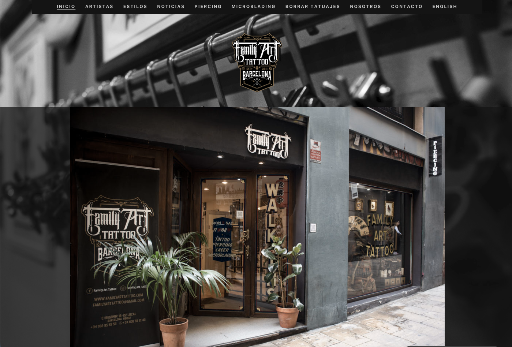
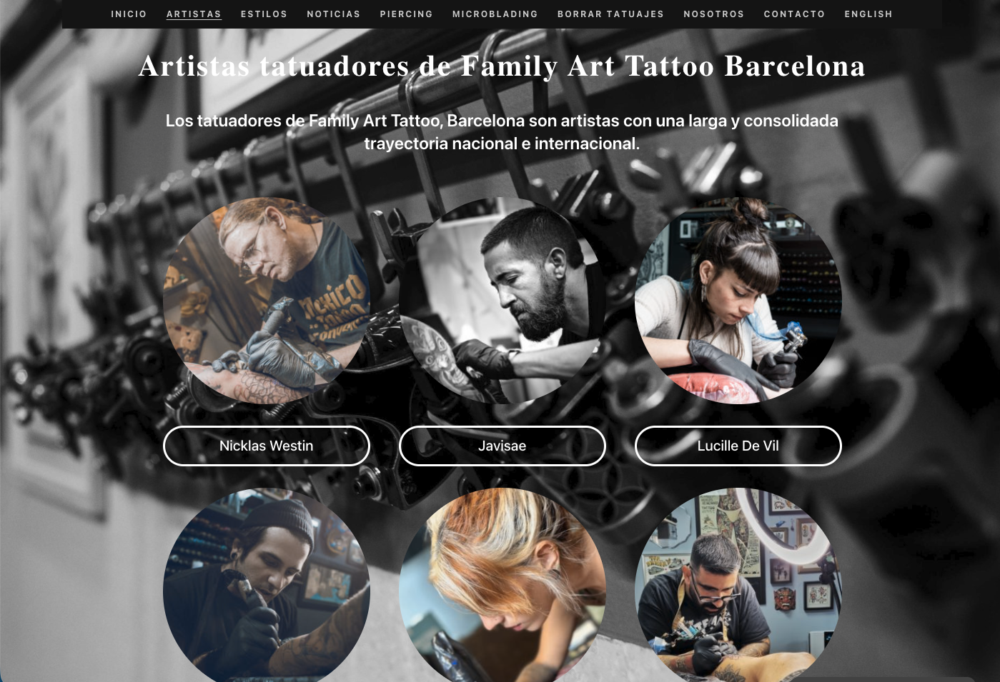
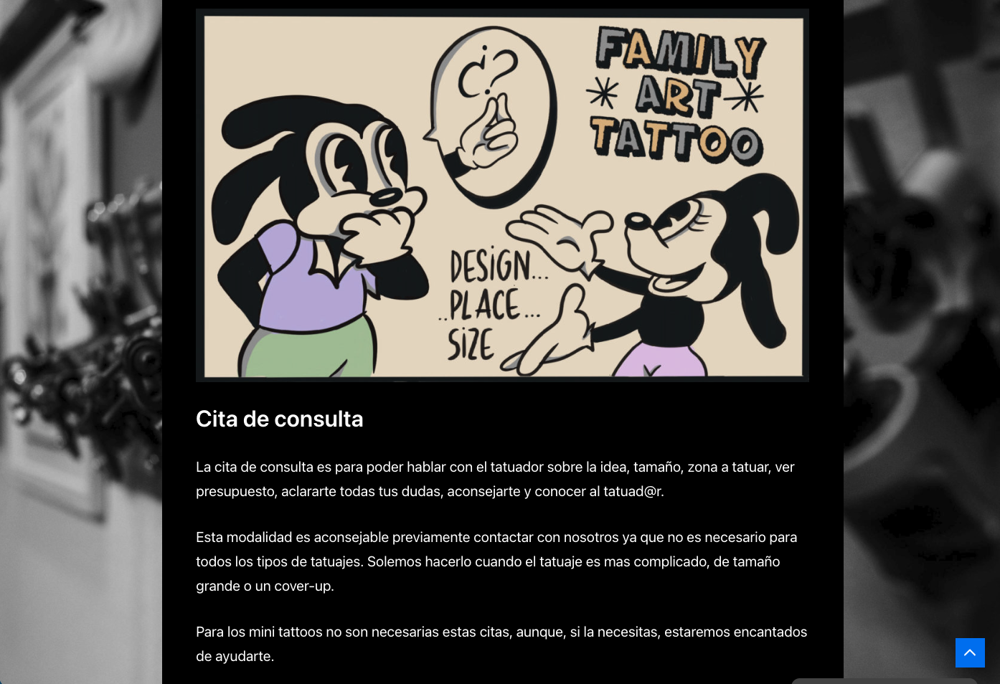

## Un estudi de tatuatge amb una manera diferent de comunicar

Family Art Tattoo és un estudi de tatuatge a Barcelona amb una filosofia clara: acompanyar el client en tot el procés de decoració corporal, des del primer contacte fins a les cures posteriors.

Aquesta manera d'entendre el servei necessitava una presència digital que l'expressés. No un catàleg de fotos, sinó una eina de comunicació real.

---

## El que vam fer

**Tema WordPress a mida, des de zero**

Dissenyat i desenvolupat completament a mida, amb una estètica fosca i expressiva coherent amb el món del tatuatge. Cap plantilla comprada, cap framework visual de tercers. El disseny va néixer del projecte, no al revés.

**Una comunicació orientada al client**

El web no és un portafoli. És una guia. El contingut explica tot el procés de la decoració corporal: com és el primer contacte, com es fa el disseny, les condicions de la sessió, i les cures necessàries durant la cicatrització. Un client informat és un client que arriba a la cita sense dubtes i amb les expectatives ben gestionades.

**Creació de continguts i SEO**

La competència al sector del tatuatge és molt alta, especialment a Barcelona. Vam treballar el posicionament des del contingut: articles de blog orientats a les preguntes reals dels clients potencials, optimització tècnica i semàntica, i estructura de la informació pensada per als motors de cerca.

**Integració amb Instagram**

Instagram és el canal principal de captació de l'estudi. Vam integrar el web amb el perfil de l'estudi per mantenir la coherència visual i facilitar que el contingut publicat a les xarxes reforci l'autoritat del web, no el substitueixi.

---

## Resultat

Les eines comunicatives i les funcionalitats que vam desenvolupar continuen en ús. El sistema funciona de manera autònoma, sense dependències externes crítiques.

---

## Captures

---

## Tecnologia

WordPress · Tema a mida · SEO · Integració Instagram · Creació de continguts

---

→ [familyarttattoo.com](https://www.familyarttattoo.com/)
→ [Solucions per a negocis locals](/solucions/microempreses/)
