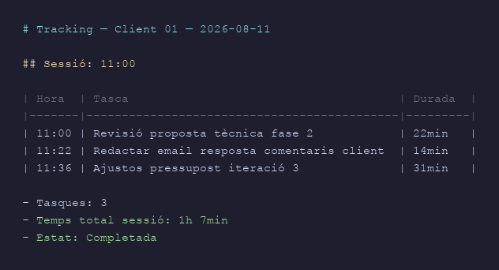
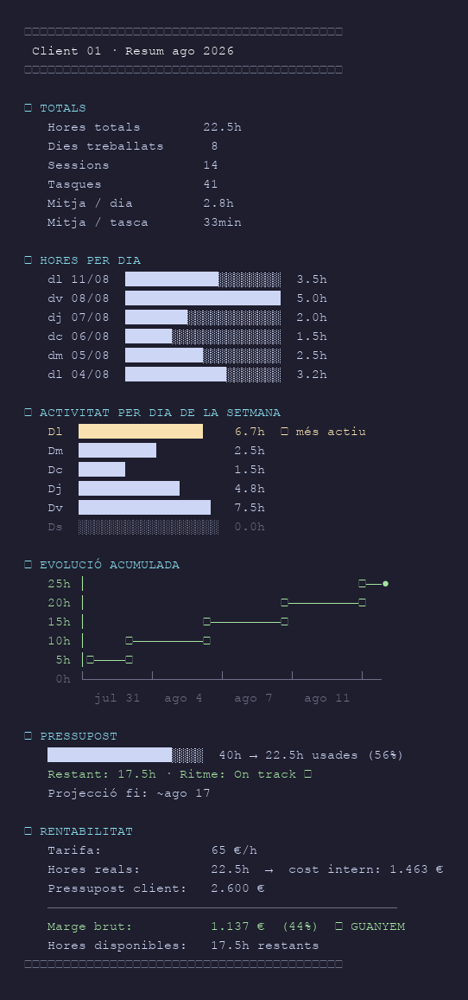
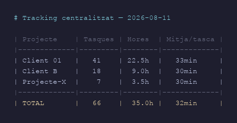

## La idea

El problema de les eines de time-tracking tradicionals és que cal recordar-se d'obrir-les i tancar-les.

La solució va ser plantejar-ho al revés: si ja treballem amb Claude Code per a gairebé tot, per què no integrar el registre de temps directament a l'assistent? Quan s'obre una sessió, el gestor s'activa. Quan es tanca, registra el temps. Cada demanda durant la sessió queda anotada com a subtasca. Tot automàtic. Tot en fitxers Markdown locals, sense subscripcions ni serveis externs.

L'objectiu: saber en tot moment quantes hores portem a cada projecte, si el pressupost aguanta, i quina és la rendibilitat real de cada client.

---

## Control

El sistema genera un fitxer diari per cada projecte. Al final de cada sessió, s'actualitza automàticament:



Quan vols la visió global d'un projecte, el report complet s'genera amb `/time-report`:



Amb diversos projectes actius simultàniament, el resum centralitzat mostra el conjunt:



---

## Tecnologia

El sistema és un **skill de Claude Code**: un fitxer Markdown de configuració que defineix el comportament de l'assistent quan treballa en un directori concret.

**Com funciona per dintre:**

- **SessionStart hook** → Claude llegeix el skill i crea l'entrada de sessió al `.taques/` del projecte actiu
- **Cada missatge de l'usuari** → es registra com a subtasca amb timestamp d'inici
- **SessionEnd / inactivitat >30 min** → Claude calcula la durada i tanca l'entrada
- **Commits de git** → si s'ha fet un commit durant la sessió, es detecta i s'anota automàticament

Tot queda escrit en fitxers `.md` locals, en mode append-only. Mai s'esborren entrades existents.

No hi ha base de dades, no hi ha servidor, no hi ha API de tercers. Són fitxers de text pla que es poden llegir, editar i fer còpies de seguretat amb qualsevol eina.

---

## On s'executa i per què

El repositori viu a **Codeberg**, no a GitHub.

Codeberg és una plataforma de codi obert gestionada per una organització sense ànim de lucre europea, amb seu a Berlín. La raó és de coherència: si el projecte és sobre tenir les dades sota control, no té sentit allotjar el codi a una plataforma propietària nord-americana.

La sincronització es fa amb un script propi (`sync-gestor-hores.sh`) que substitueix el workflow habitual de GitHub:

```
→ Sincronitzant amb origin/main (Codeberg)...
→ Pull --rebase de origin/main...
→ Rebase OK.
→ Push a origin/main...

✓ SINCRONITZACIÓ COMPLETADA
  - Commit local nou:       sí
  - Últim commit:           sync: 2026-08-11 12:03 — gestor d'hores
  - Branca:                 main → origin
```

El script fa tres coses: commit dels canvis locals, pull amb rebase (els fitxers `.taques/*.md` estan configurats amb `merge=union` per fusionar sessions concurrents sense conflictes), i push. Si hi ha un conflicte real, atura i informa sense deixar el repositori en mal estat.

---

## Disponibilitat

El codi és obert i disponible a [Codeberg](https://codeberg.org/linuxbcn/gestor-hores). Per instal·lar-lo en un projecte existent de Claude Code:

```bash
# Còpia el skill al directori de skills de Claude
cp SKILL.md ~/.claude/skills/gestor-hores/SKILL.md

# Configura el pressupost del primer projecte
/time-config client-01 40 65 2600
```

A partir d'aquí, cada sessió queda registrada sola.

**Requisits:**
- Claude Code (CLI o app de desktop)
- Git local al directori del projecte
- Accés a Codeberg (o qualsevol remot git) per sincronitzar

No hi ha dependències de npm, Python ni cap altra cadena d'eines. El skill és un fitxer de text, el tracking és Markdown, la sincronització és git.
