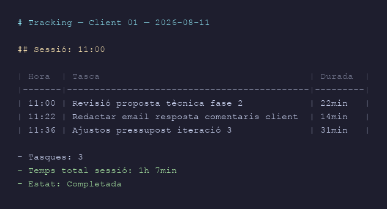
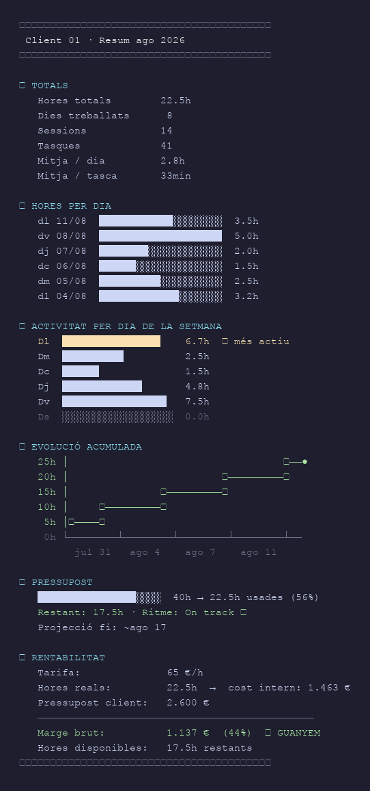
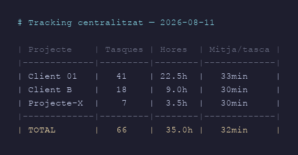

## The idea

The trouble with traditional time-tracking tools is that you have to remember to start and stop them.

So we turned it around: if we already use Claude Code for almost everything, why not build time tracking into the assistant itself? When a session opens, the tracker starts. When it closes, the time is logged. Every request made during the session is recorded as a subtask. All automatic. All in local Markdown files, with no subscriptions and no external services.

The goal: to know at any moment how many hours have gone into each project, whether the budget is holding, and what each client is really worth.

---

## Control

The system writes one file per day for each project. At the end of every session it updates itself:



For the full picture of a project, the complete report is generated with `/time-report`:



With several projects running at once, the central summary shows them all together:



---

## Technology

The system is a **Claude Code skill**: a Markdown configuration file that defines how the assistant behaves when it works in a given directory.

**How it works inside:**

- **SessionStart hook** → Claude reads the skill and creates the session entry in the active project's `.taques/` folder
- **Each user message** → logged as a subtask with a start timestamp
- **SessionEnd / more than 30 min idle** → Claude works out the duration and closes the entry
- **Git commits** → if a commit was made during the session, it is detected and noted automatically

Everything is written to local `.md` files, append-only. Existing entries are never deleted.

There is no database, no server and no third-party API. They are plain text files that can be read, edited and backed up with any tool.

---

## Where it runs and why

The repository lives on **Codeberg**, not GitHub.

Codeberg is an open source platform run by a European non-profit based in Berlin. The reason is consistency: if the project is about keeping your data under your own control, it makes no sense to host the code on a proprietary US platform.

Syncing is done with our own script (`sync-gestor-hores.sh`), which replaces the usual GitHub workflow:

```
→ Sincronitzant amb origin/main (Codeberg)...
→ Pull --rebase de origin/main...
→ Rebase OK.
→ Push a origin/main...

✓ SINCRONITZACIÓ COMPLETADA
  - Commit local nou:       sí
  - Últim commit:           sync: 2026-08-11 12:03 — gestor d'hores
  - Branca:                 main → origin
```

The script does three things: commits local changes, pulls with rebase (the `.taques/*.md` files use `merge=union` so concurrent sessions merge without conflicts), and pushes. If there is a real conflict, it stops and reports it without leaving the repository in a broken state.

---

## Availability

The code is open and available on [Codeberg](https://codeberg.org/linuxbcn/gestor-hores). To install it in an existing Claude Code project:

```bash
# Copy the skill into Claude's skills directory
cp SKILL.md ~/.claude/skills/gestor-hores/SKILL.md

# Set the budget for the first project
/time-config client-01 40 65 2600
```

From then on, every session is logged on its own.

**Requirements:**
- Claude Code (CLI or desktop app)
- Local git in the project directory
- Access to Codeberg (or any git remote) for syncing

No npm, Python or any other toolchain. The skill is a text file, the tracking is Markdown, the sync is git.
