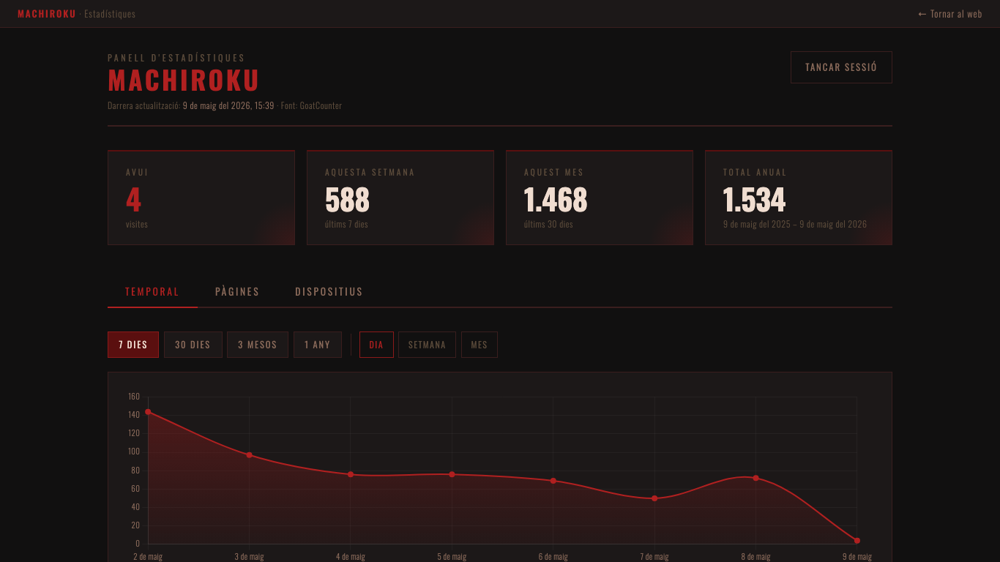
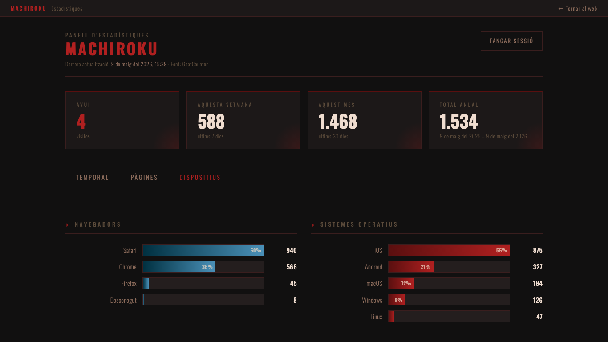
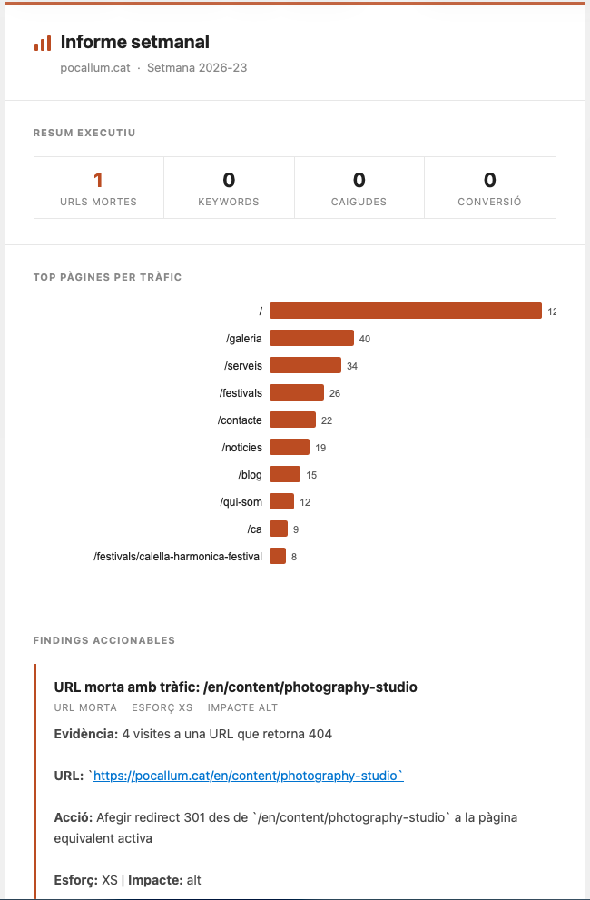

## Clear analytics for static websites

A web analytics dashboard that shows exactly what you need to know
about your visitors. No noise. No cookies. No subscriptions.

---

## The problem

Conventional analytics tools — Google Analytics and similar — are built
for marketing teams that want aggressive tracking.
For a local business, a school or an association,
they're excessive, invasive, and often blocked by browsers.

GoatCounter is a free, privacy-respecting alternative.
But its interface isn't immediate: you have to interpret tables,
navigate through panels, and the workflow is slow and manual.

---

## The solution

The **GoatCounter Dashboard** is a lightweight panel that reads data
from GoatCounter and presents it in a direct, clear and useful way.

One API call, a cached JSON file, and a dashboard
that loads instantly. No database, no dedicated server,
no external dependencies.

**What it shows:**

- Visits today / last 7 days / 30 days / annual total
- Average daily visits
- Interactive temporal chart (day / week / month · 7d / 30d / 3m / 1y)
- Most visited pages and sections
- Language and referrer breakdown
- Location by country
- Browsers, operating systems, and device types

---

## What the data reveals

When you install the dashboard on a restaurant website,
the data confirms what you already suspected — and helps you act:

**60% of visitors use Safari. 77% visit from a mobile device.**

It makes complete sense: people look for somewhere to have dinner
while they're out walking, or decide where to eat from the sofa
on a Saturday afternoon.

Knowing this with concrete data isn't an academic exercise.
It means the design has to be flawless on a small screen.
That key information must be visible without scrolling.
That the restaurant's phone number must be one tap away.

Data doesn't change your intuition — it confirms it
and gives you the arguments to make decisions without hesitation.

---

## How it works

The dashboard integrates with any static website:
Hugo, Jekyll, Eleventy, or even a plain HTML folder.

A PHP script — or a GitHub Actions workflow for fully static sites —
queries the GoatCounter API once, writes a cached `analytics.json` file,
and from there everything runs in the browser.

Access is protected with a password (SHA-256, no server required).
The design uses IBM Plex Mono, works well on mobile,
and loads no external resources.

---

## Result

A dashboard that installs in minutes and runs for years
without maintenance, without renewing subscriptions,
without handing data to third parties.

The information that actually matters, presented so that
anyone in the business can read and understand it.

---

## Weekly intelligence agent

The dashboard is the starting point. The agent automates the follow-up.

Every Monday, a GitHub Actions workflow runs four detectors
against GoatCounter and Google Search Console data:

- **Dead URLs with traffic** — pages receiving visits that return 404
- **Keyword opportunities** — terms where the site ranks between positions 4–20
- **Section drops** — sections with a traffic drop above 30%
- **Low conversion** — contact or service pages with low relative traffic

The results are packaged into an HTML report and sent by email.
Each finding includes evidence, a recommended action, and an effort estimate.
When the action is clear, the agent opens a GitHub Issue directly in the repository.

No manual reviews. No open dashboards. The report arrives, you read it, you decide.

---

## Technology

Hugo · GoatCounter · PHP · GitHub Actions · Chart.js · IBM Plex Mono · Google Search Console · Python

---

→ [Repository on GitHub](https://github.com/112books/goatcounter-dashboard)
→ [GoatCounter — respectful analytics](https://www.goatcounter.com)
