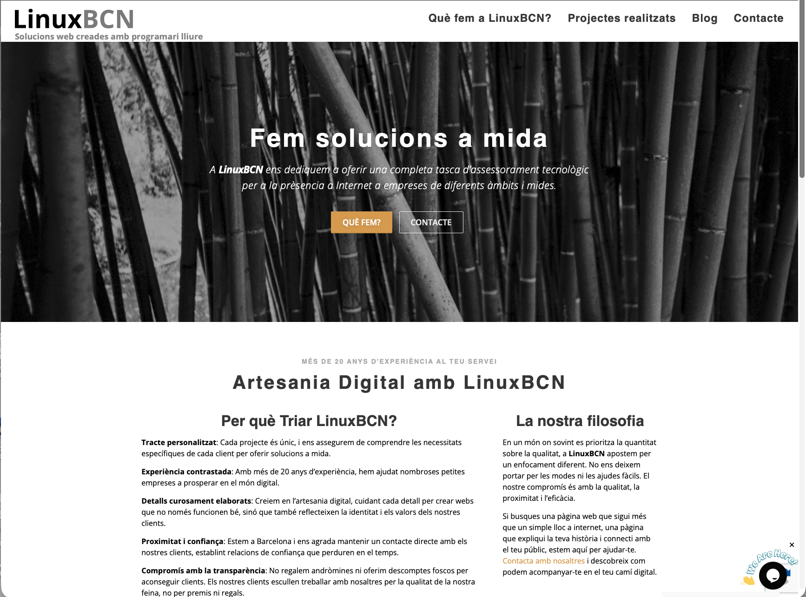
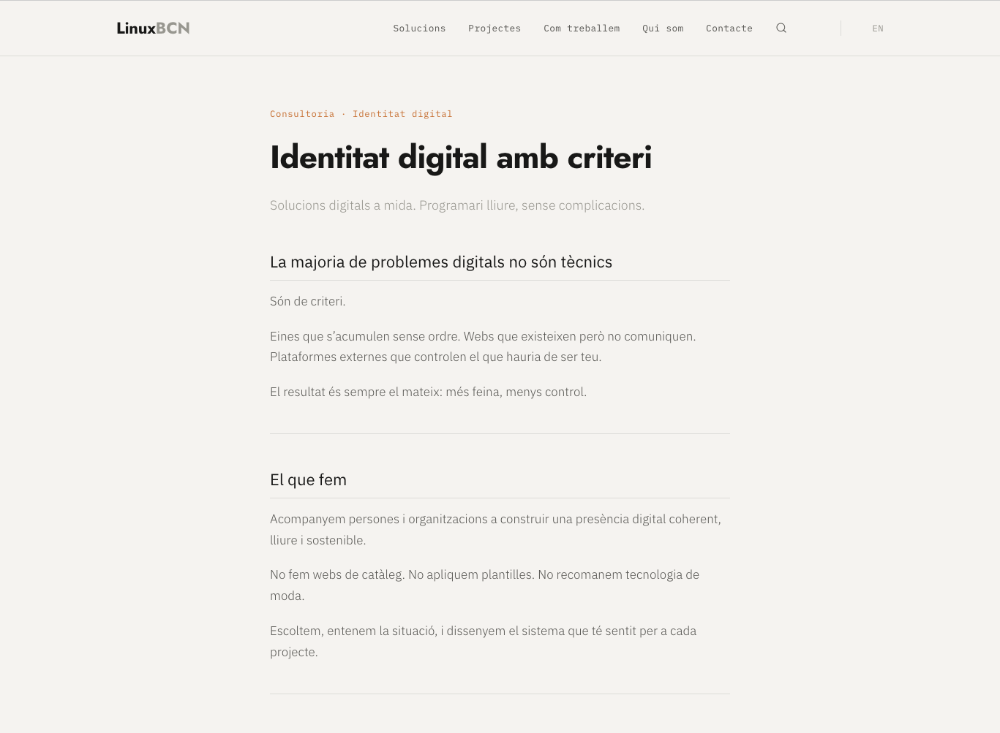

## Aquest mateix web

LinuxBCN.com és en si mateix un exemple del sistema
que proposem als nostres clients.

Construït amb Hugo, lleuger, ràpid i mantenible.
Trilingüe des del primer dia.
Sense plugins innecessaris, sense dependències externes.

La metodologia que apliquem a cada projecte,
aplicada primer a nosaltres mateixos.

---

## Abans i després

La web anterior: WordPress acumulatiu, difícil de mantenir.

El nou sistema: lleuger, estructurat i coherent.

---

→ [linuxbcn.com](https://linuxbcn.com)
→ [Com treballem](/com-treballem/)