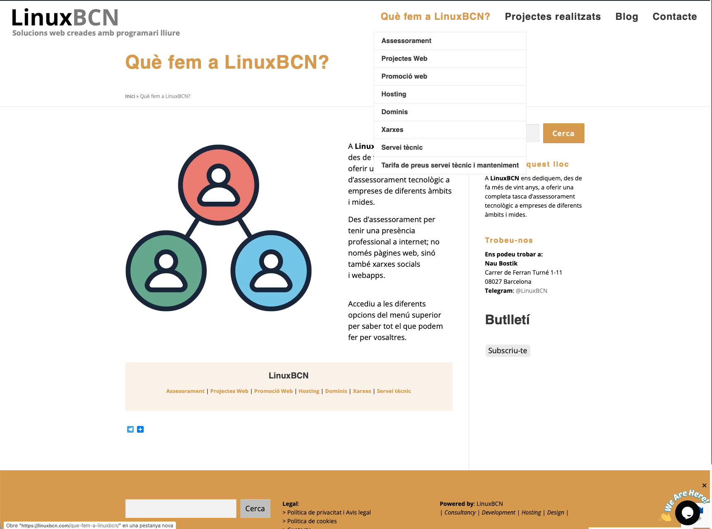
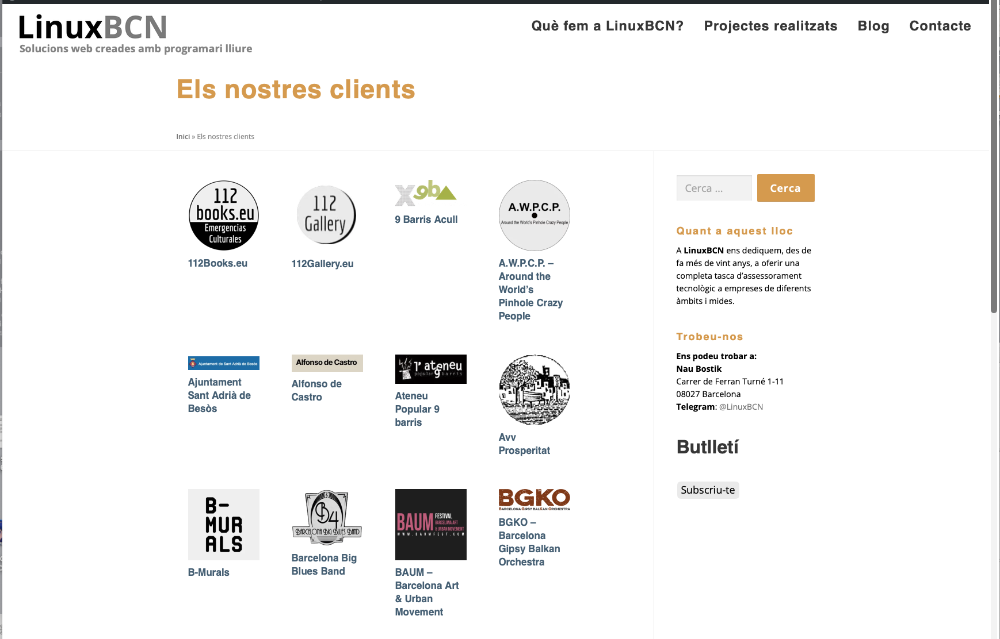

## El nostre propi web com a primer projecte

Si recomanem una manera de treballar, el mínim és aplicar-la a nosaltres mateixos.

LinuxBCN.com és el projecte on hem implementat, provat i depurat cada decisió tècnica que després traslladem als clients: arquitectura lleugera, privacitat per disseny, accessibilitat real i sobirania sobre les dades. No és un exemple artificial — és el sistema que fem servir cada dia.

---

## El problema

El web anterior era un WordPress. Funcional, però:

- Ple de plugins acumulats al llarg dels anys, molts ja sense manteniment
- Dependent d'actualitzacions constants per no quedar exposat
- Lent per defecte, sense optimització possible sense afegir més capes
- Sense control real sobre les dades analítiques (Google Analytics)
- Difícil de mantenir sense entrar al panell d'administració

El problema no era WordPress en si. Era l'acumulació de decisions sense criteri al llarg del temps. Un web que havia crescut sense arquitectura.

---

## La solució

Migració completa a **Hugo** amb un tema fet des de zero. Sense base de tercers, sense herència de decisions alienes.

**Tema 100% propi**
Cada línia de CSS i de plantilla escrita expressament per a aquest projecte. Estètica *minimal · hacking · jazz Monk*: estructura rigorosa, expressió lliure dins dels límits. Fonts auto-allotjades (IBM Plex Sans, IBM Plex Mono), sense cap petició a Google Fonts.

**Bilingüe real**
Català com a llengua principal, anglès com a segona llengua. Cada URL, cada metadada, cada etiqueta hreflang configurada manualment. El castellà descartat explícitament — decisió estratègica de posicionament, no una limitació tècnica.

**Zero dependències externes no auditades**
Cap CDN extern. Cap script de tercers que no hàgim llegit. Cap framework JS. L'únic JavaScript del frontend és el que hem escrit nosaltres o hem revisat línia per línia.

**Analítica respectuosa**
GoatCounter en lloc de Google Analytics. Dashboard privat a `/admin/` construït a mida amb Chart.js auto-allotjat. Les dades queden al nostre servidor, no a cap corporació nord-americana.

**Sense Google. Punt.**
Ni Analytics, ni Fonts, ni Maps, ni reCAPTCHA, ni Tag Manager. Cada servei de Google que elimines és un tracker menys sobre els teus visitants.

**Accessibilitat WCAG 2.1 AA**
Skip-to-content, contrast revisat, tot el contingut accessible per teclat, textos alternatius, estructura semàntica correcta. No com a compliment normatiu sinó perquè és el mínim exigible.

**SEO tècnic sòlid**
Schema.org JSON-LD per a negoci local i persona, hreflang correctes, sitemap XML, Open Graph i Twitter Card per a totes les pàgines, `llms.txt` per a visibilitat en motors d'IA (ChatGPT, Perplexity, Claude).

**Infraestructura sobirana**
Codi a GitHub. Staging a GitHub Pages. Producció a VPS propi a Dinahosting — servidor a Europa, dades sota control. Deploy manual via rsync: sabem exactament què puja i quan.

---

## Resultat

Un web que carrega en menys de 200ms. Que no necessita actualitzacions de seguretat setmanals. Que podem modificar amb un editor de text i desplegar en dos minuts. Que no envia cap dada dels visitants a tercers sense el seu consentiment.

I sobretot: un web que entenem completament. Sense capes opaques, sense dependències que no controlem, sense sorpreses.

---

## Tecnologia

Hugo · Tema propi · IBM Plex Sans/Mono · GoatCounter · Chart.js · Decap CMS · GitHub Pages · VPS Dinahosting · Schema.org · llms.txt · WCAG 2.1 AA · IndexNow

---

## Abans i després

El punt de partida: WordPress acumulatiu, difícil de mantenir.

El nou sistema: lleuger, estructurat i coherent amb els valors que defensem.

---

→ [linuxbcn.com](https://linuxbcn.com)
→ [Com treballem](/com-treballem/)
