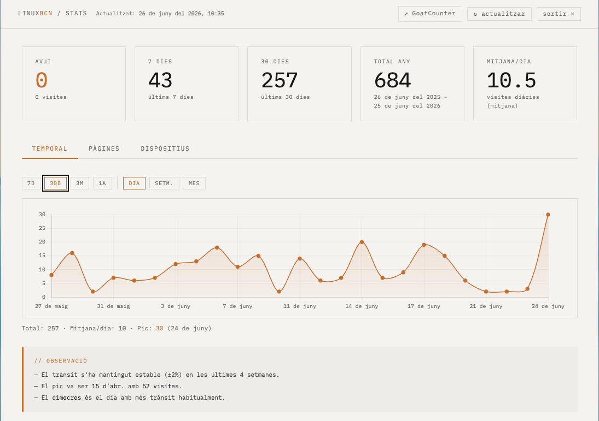
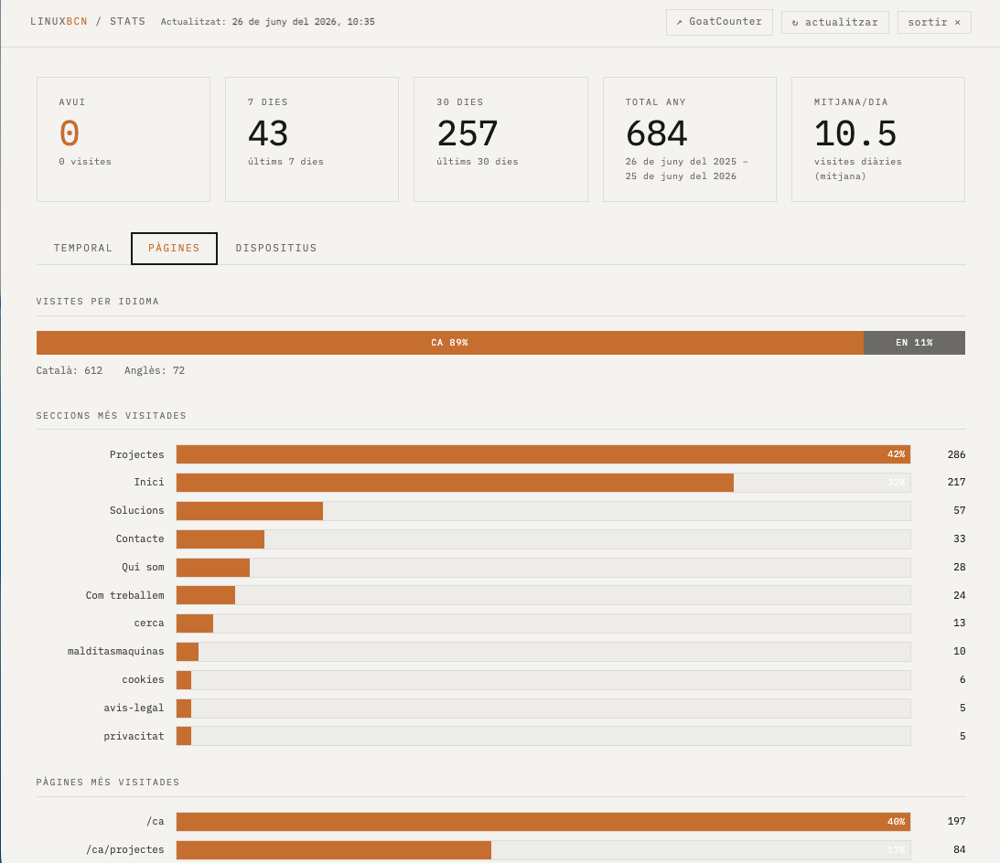
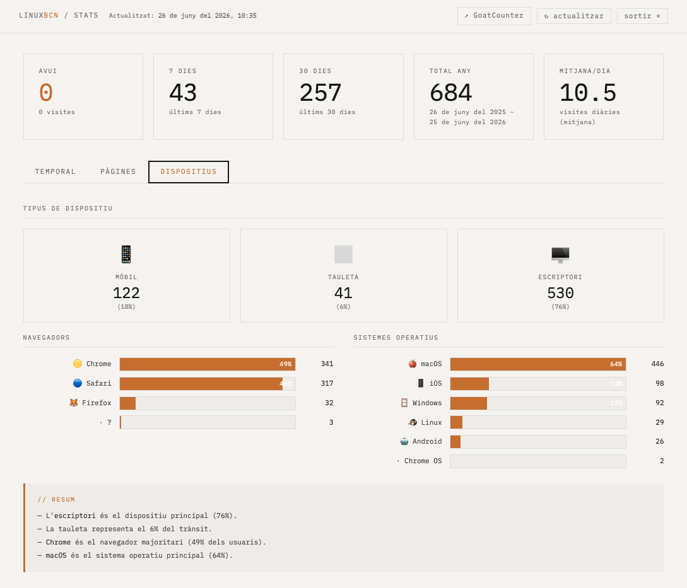

## Our own website as a first project

If we recommend a way of working, the least we can do is apply it to ourselves.

LinuxBCN.com is the project where we have implemented, tested and refined every technical decision we later bring to clients: lightweight architecture, privacy by design, real accessibility and data sovereignty. It's not an artificial example — it's the system we use every day.

---

## The problem

The previous website was a WordPress. Functional, but:

- Full of plugins accumulated over years, many no longer maintained
- Dependent on constant updates to avoid exposure
- Slow by default, impossible to optimise without adding more layers
- No real control over analytics data (Google Analytics)
- Difficult to maintain without logging into an admin panel

The problem wasn't WordPress itself. It was the accumulation of thoughtless decisions over time. A website that had grown without architecture.

---

## The solution

Full migration to **Hugo** with a theme built from scratch. No third-party base, no inherited decisions.

**100% custom theme**
Every line of CSS and every template written specifically for this project. *Minimal · hacking · jazz Monk* aesthetic: rigid structure, free expression within limits. Self-hosted fonts (IBM Plex Sans, IBM Plex Mono) — no requests to Google Fonts.

**Real multilingual**
Catalan as the primary language, English as the second. Every URL, every metadata tag, every hreflang configured manually. Spanish explicitly dropped — a strategic positioning decision, not a technical limitation.

**Zero unaudited external dependencies**
No external CDN. No third-party scripts we haven't read. No JS framework. The only JavaScript in the frontend is what we wrote ourselves or reviewed line by line.

**Privacy-respecting analytics**
GoatCounter instead of Google Analytics. Private dashboard at `/admin/` built in-house with self-hosted Chart.js. Data stays on our server, not with any American corporation.

**No Google. Full stop.**
No Analytics, no Fonts, no Maps, no reCAPTCHA, no Tag Manager. Every Google service you remove is one fewer tracker on your visitors.

**WCAG 2.1 AA accessibility**
Skip-to-content, reviewed contrast, all content keyboard-accessible, alternative texts, correct semantic structure. Not as regulatory compliance but because it's the basic minimum.

**Solid technical SEO**
Schema.org JSON-LD for local business and person, correct hreflang, XML sitemap, Open Graph and Twitter Card for all pages, `llms.txt` for visibility in AI engines (ChatGPT, Perplexity, Claude).

**Sovereign infrastructure**
Code on GitHub. Staging on GitHub Pages. Production on our own VPS at Dinahosting — server in Europe, data under control. Manual deploy via rsync: we know exactly what goes up and when.

---

## Result

A website that loads in under 200ms. That doesn't need weekly security updates. That we can modify with a text editor and deploy in two minutes. That sends no visitor data to third parties without their consent.

And above all: a website we understand completely. No opaque layers, no uncontrolled dependencies, no surprises.

---

## Technology

Hugo · Custom theme · IBM Plex Sans/Mono · GoatCounter · Chart.js · Decap CMS · GitHub Pages · VPS Dinahosting · Schema.org · llms.txt · WCAG 2.1 AA · IndexNow

---

## Before and after

The starting point: accumulated WordPress, hard to maintain.

The new system: lightweight, structured and coherent with the values we defend.

---

## Custom analytics dashboard

Private dashboard at `/admin/` built in-house: KPIs, visits chart and automatic data interpretation. No Google Analytics, no data sent to third-party servers.

---

→ [linuxbcn.com](https://linuxbcn.com)
→ [How we work](/com-treballem/)
