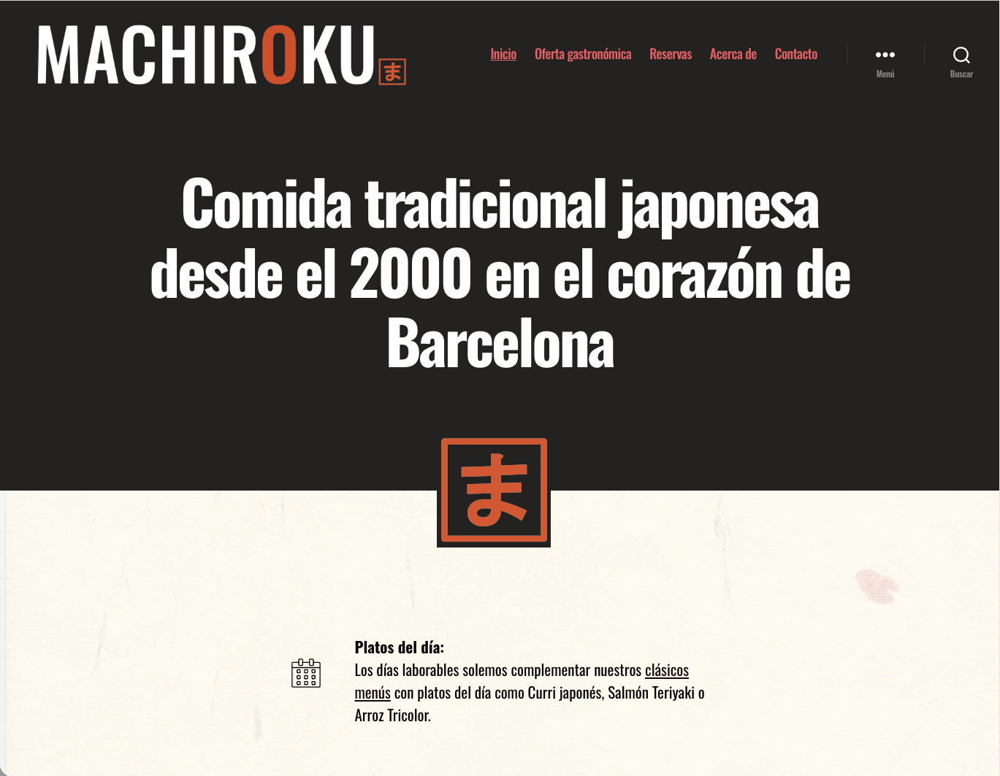
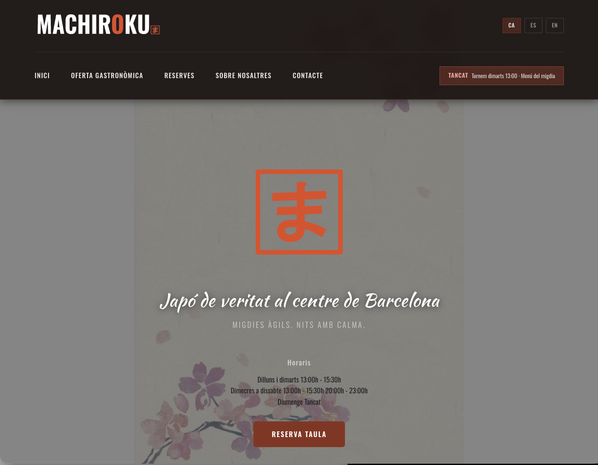
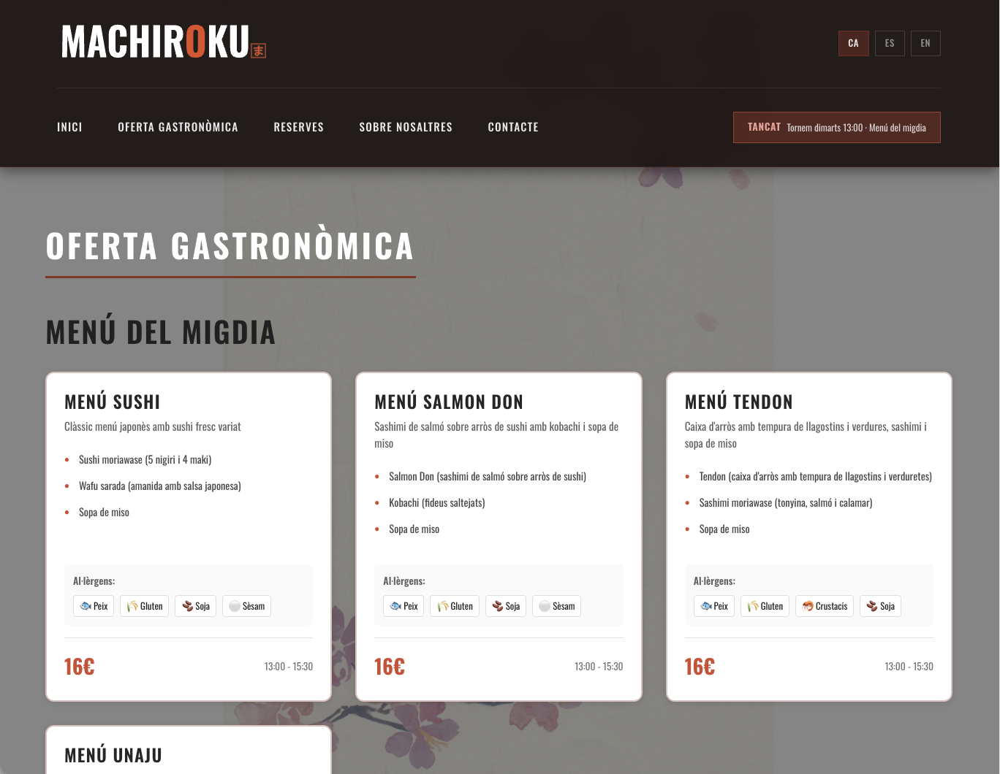
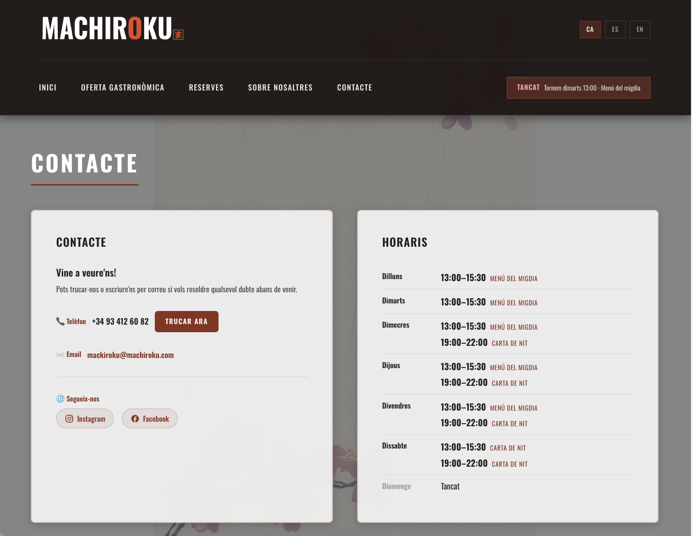
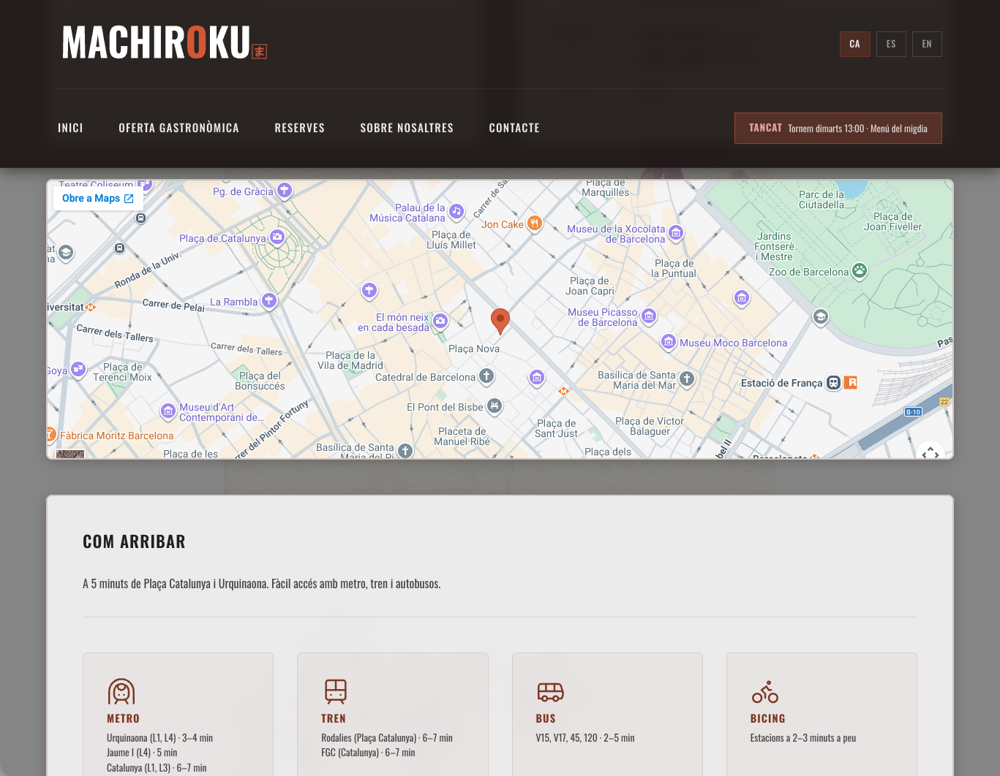

## A Japanese restaurant in the heart of Barcelona

Machiroku is a small family restaurant specialising
in authentic Japanese cuisine in the heart of Barcelona.

The previous website was a conventional WordPress: functional,
but heavy, hard to maintain and with no adaptation
to the restaurant's real needs.

---

## The problem

A restaurant needs to update its menu, opening hours
and notices frequently. With WordPress, every change
required accessing a complex manager or depending
on someone external.

The website also wasn't designed for mobile —
the main channel of their customers.

---

## The solution

We built a lightweight Hugo-based system
with one clear premise: mobile first, everything else second.

**Designed from the phone**
Redesigned from scratch with the mobile version as the
starting point. Fast, clear and easy to navigate on a small screen.

**Direct management without intermediaries**
Menu, opening hours and content in Catalan, Spanish and English
edited directly on GitHub. No complex panels,
no plugins, no waiting for anyone.

**Real-time restaurant status**
The website automatically shows whether the restaurant is open
or closed, whether it offers a set menu or only à la carte,
and until what time it's open — or when it reopens.

**Alerts and special notices**
For public holidays, events or opening hour changes,
the system allows activating pop-up notices quickly
and without touching code.

**Automated allergen information**
Allergen information is managed centrally
and updates automatically across the entire menu.

**Reservations without commissions**
Direct reservation system by phone, with the option
to integrate WhatsApp with automations if the business needs it.
No third-party platforms, no commission per booking.

**Contact and how to get here**
Reservations page with detailed accessibility information:
travel time from metro, bus, bike sharing, airport,
port and train station. All calculated and presented clearly.

**Privacy and legal texts**
Google Analytics has been dropped. The system
uses privacy-respecting measurement tools.
Legal texts have been written from scratch accordingly.

**Integrated reputation**
Direct link to Google Reviews to show
the restaurant's real rating without leaving the website.

---

## Result

A fast, lightweight and autonomous website that the restaurant
manages without depending on anyone external.

No subscriptions. No commissions.
No calling anyone to change Wednesday's opening hours.

---

## Technology

Hugo · GitHub · Multilingual · Mobile-first · Privacy analytics

---

## Before and after

The previous website: conventional WordPress, without adaptation to real needs.

The new system: mobile-first, lightweight and self-manageable.

---

→ [Visit the website](https://machiroku.com)
→ [Solutions for values-driven businesses](/solucions/microempreses/)