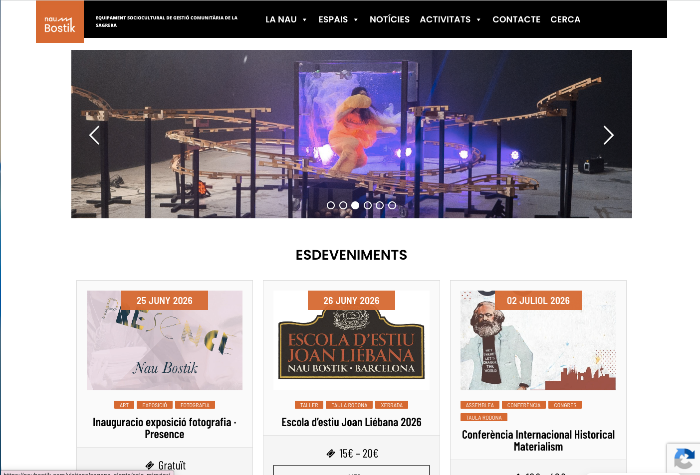
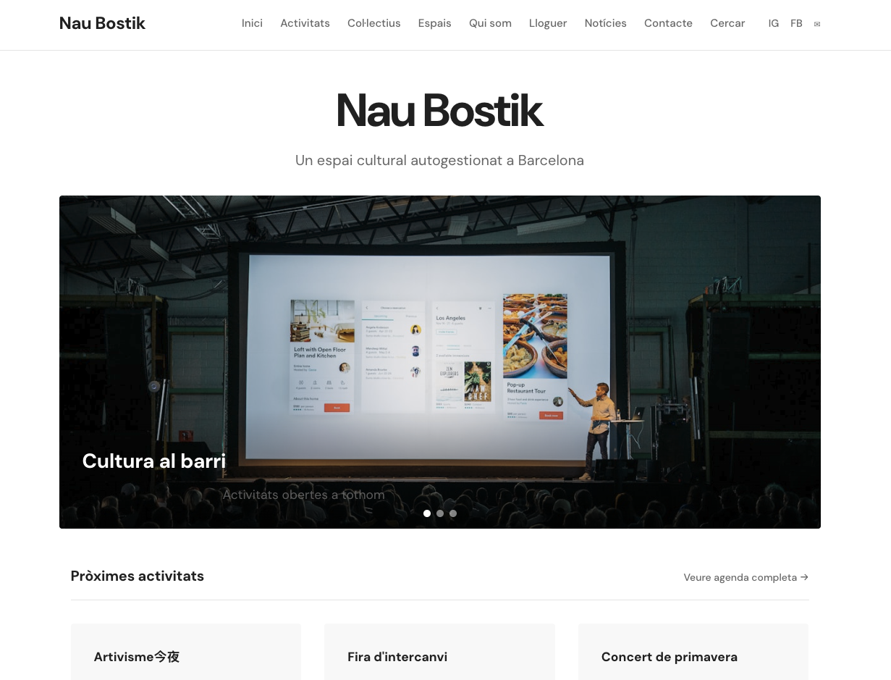

## A project in two phases

Nau Bostik is a self-managed sociocultural space in the Sagrera neighbourhood, Barcelona. Intense activity, diverse community, constant agenda and completely horizontal management.

Our relationship with the project has had two distinct stages.

---

## Phase 1 — Emergency recovery

When the old website stopped working, the situation needed an immediate response. We built a functional, stable and clean site in the shortest possible time: enough to maintain the space's digital presence while the real solution was being prepared.

The current website is the result of that emergency work.

---

## Phase 2 — Structural replanning (in progress)

The real challenge isn't building a new website. It's building a digital tool that matches the ambition of the space: a system that reflects and reinforces how the organisation works from within.

The proposal we're working on includes:

- Collective agenda managed from within, without intermediaries
- Shared space and resource management across collectives
- Transparent communication with the neighbourhood and member organisations
- Self-management tools for the groups that coexist there
- 100% free software infrastructure, hosted with European providers

The website is not the final product. It is the seed of a structural shift in how the space relates digitally to its environment.

---

## Current status

**In the replanning phase.** The technical and conceptual proposal has been developed and received internal validation. Pending final approval and securing funding for the full development.

---

## Screenshots

---

→ [Solutions for entities and collectives](/solucions/collectius/)
